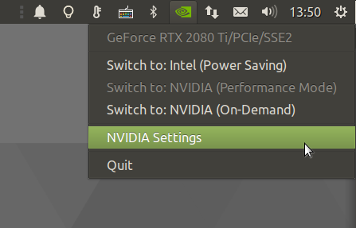

<h1 align="center">
  
  <br />
  MATE Optimus
</h1>

<p align="center"><b>NVIDIA Optimus GPU switcher</b></p>

<div align="center"></div>

<p align="center">Made with 💝 for </p>

## Installation

### Ubuntu

```bash
sudo apt install mate-optimus
```

### Fedora

```bash
sudo dnf install mate-optimus
```

## Configuration

The MATE Optimus indicator will not appear unless you have a compatible system
and the appropriate drivers are installed. In the case of using NVIDIA
On-Demand (known as PRIME Render Offload) you will require the NVIDA 435
drivers and a GPU screen configured. See [Chapter 35. PRIME Render Offload](https://download.nvidia.com/XFree86/Linux-x86_64/435.21/README/primerenderoffload.html)
from the NVIDIA Installation and Configuration Instructions for more details.

Wrappers, called `offload-glx` & `offload-vulkan` can be used to easily offload
games and applications to the PRIME renderer. For example:

    offload-glx glmark2
    offload-vulkan vkcube

## Building & Testing

### Source

You'll need the following dependencies:

  * `gir1.2-gtk-3.0`
  * `gir1.2-notify-0.7`
  * `glew-utils`
  * `python3`
  * `python3-gi`
  * `python3-setproctitle`
